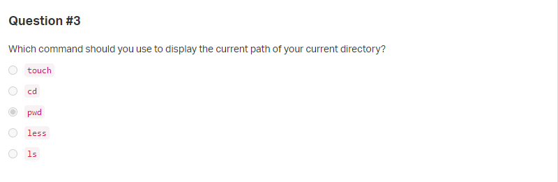
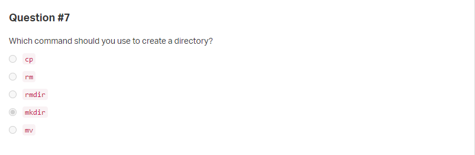
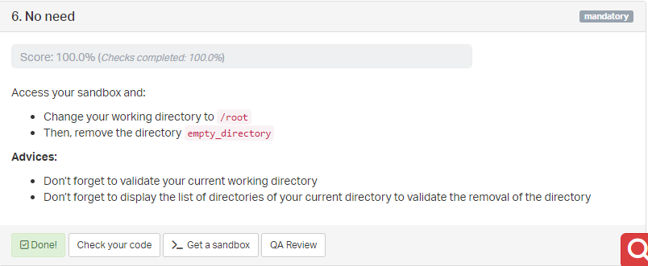

0x00. Shell, navigation
=======================
`Shell` `Bash`

**Welcome to the Matrix!**

This project will (probably) be your first experience with an Unix terminal!
For this project, please start and connect to your Sandbox `Ubuntu 20.04`.

## Resources
**Read or watch:**
  * [Linux navigation](http://linuxcommand.org/lc3_lts0020.php)
  * [Linux - looking around](http://linuxcommand.org/lc3_lts0030.php)
  * [Linux - manipulating files](http://linuxcommand.org/lc3_lts0050.php)

**Or in your terminal:**
  * `man pwd`
  * `man ls`
  * `man less`
  * `man touch`
  * `man cp`
  * `man mv`
  * `man rm`
  * `man mkdir`
  * `man rmdir`

**Extra resources:**
  * [Linux - /tmp](https://tldp.org/LDP/Linux-Filesystem-Hierarchy/html/tmp.html)

## Learning Objectives
At the end of this project, you are expected to be able to [explain to anyone](https://fs.blog/feynman-technique/), **without the help of Google**:

### General
  * How to navigate in an Unix system
  * How to list files and directories
  * How to display the content of a file
  * How to create a file or directory
  * How to remove a file or directory
  * How to move or copy a file or directory

## Requirements
  * All tasks must be done inside the sandbox Ubuntu 20.04
  * Your sandbox must be available at the end of this project - the Checker will access to it at midnight for running the correction!

## Quize Question

## Tasks

