# 0x02-Emacs
`Shell` `Editor`
## Congrats!
Now you know how to navigate into a Unix system!

It’s time to test and decide what will be your favorite text editor on your sandbox: `Emacs` or `Vi`.

During this project you will play with `Emacs`.

## Resources
**Read or watch:**
  * [A Guided Tour of Emacs](https://www.gnu.org/software/emacs/tour/)

## Learning Objectives
At the end of this project, you are expected to be able to [explain to anyone](https://fs.blog/feynman-technique/), without the help of Google:

### General
  * What is Emacs
  * Who is Richard Stallman
  * How to open and save files
  * What is a buffer and how to switch from one to the other
  * How to use the mark and the point to set the region
  * How to cut and paste lines and regions
  * How to search forward and backward
  * How to invoke commands by name
  * How to undo
  * How to cancel half-entered commands
  * How to quit Emacs

## Quize Questions
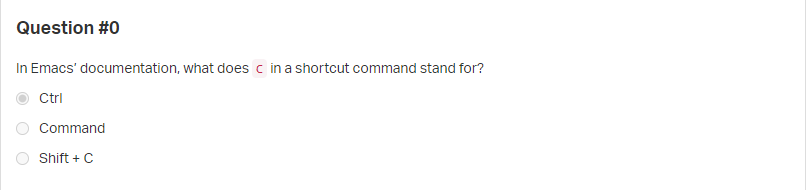
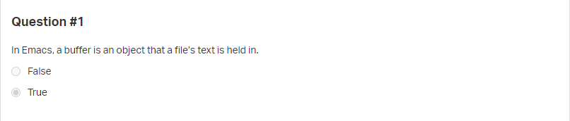
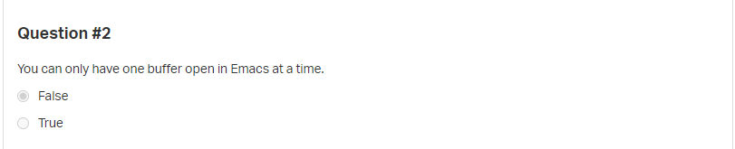
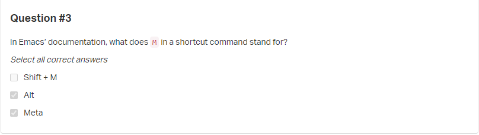

## Tasks
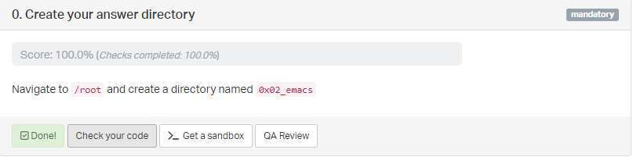
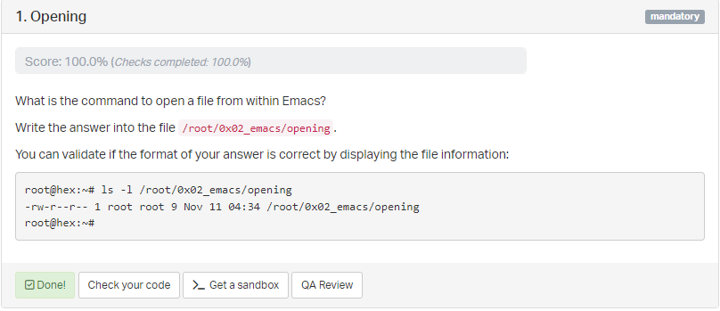

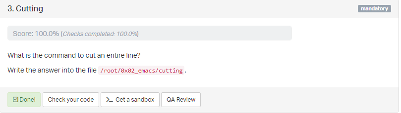
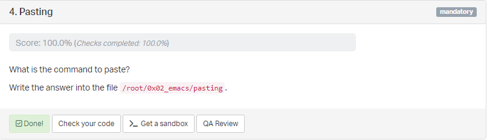
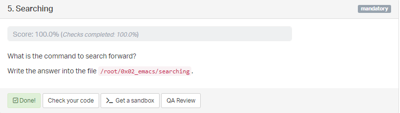
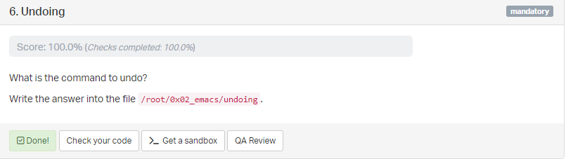
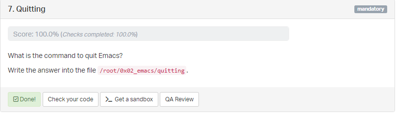