# 0x03. vi
`Shell` `Editor`

## Another text editor
After Emacs, it’s time to play with Vi.

## Resources
**Read or watch:**
  * [Basic vi Commands](https://www.cs.colostate.edu/helpdocs/vi.html)

## Learning Objectives
At the end of this project, you are expected to be able to [explain to anyone](https://fs.blog/feynman-learning-technique/?fbclid=IwAR2K5_BGPVo0QjJXkOIIqNsqcXK4lTskPWJvA0asKQIGtCPWaQBdKmj1Ztg), **without the help of Google**:

###  General
  * What is vi
  * Who is Bill Joy
  * How to start and exit vi
  * What are the command and insert modes, and how to switch from one to the other
  * How to edit text
  * How to cut and paste lines
  * How to search forward and backward
  * How to undo
  * How to quit vi

## Quiz Questions
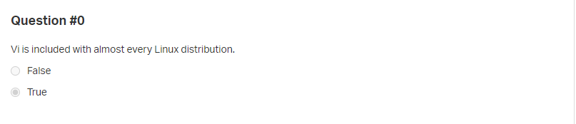
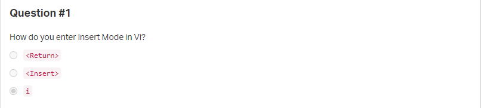
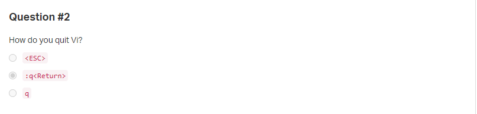
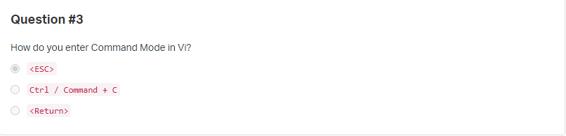

## Tasks
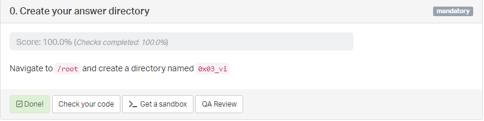
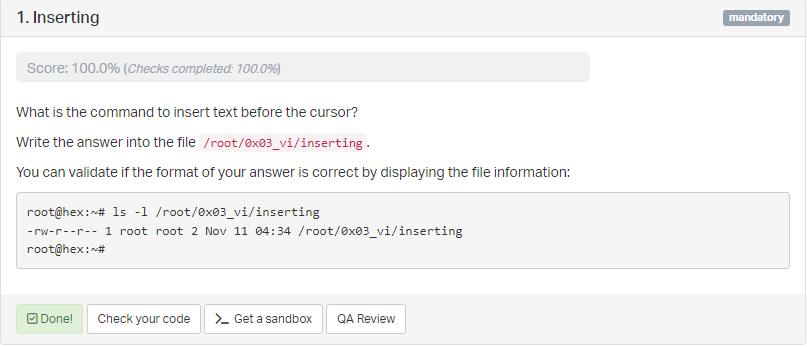
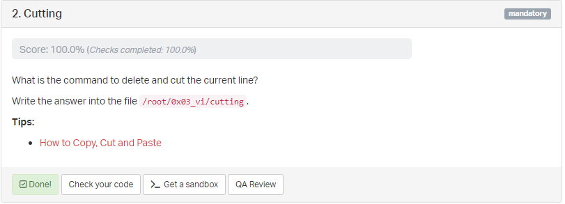
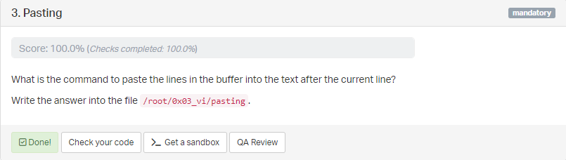
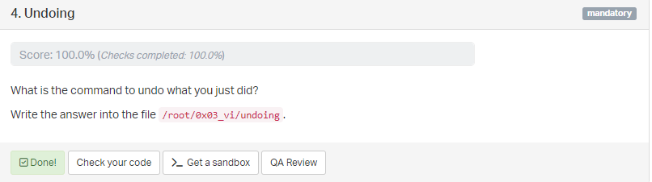
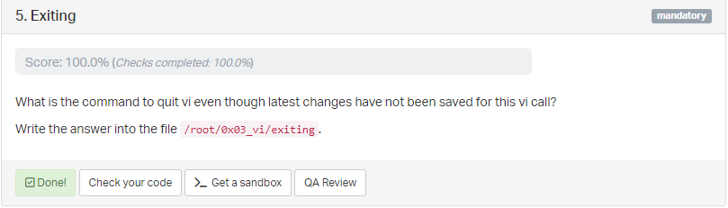
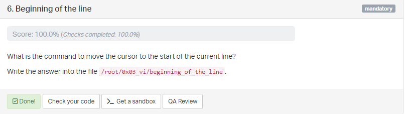
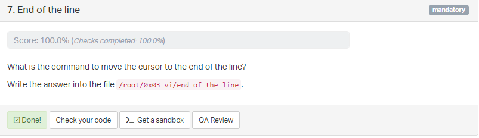

