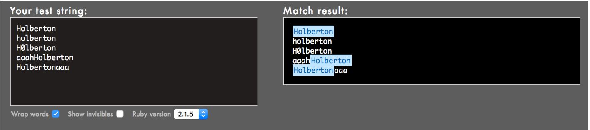
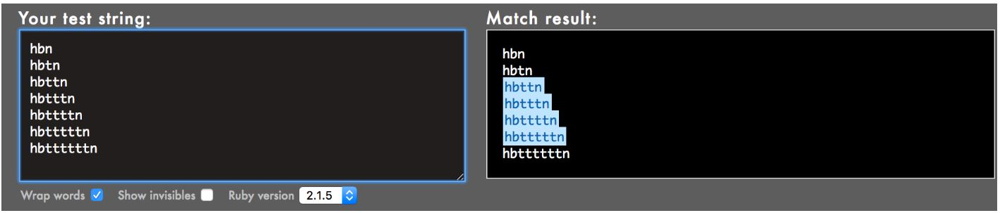
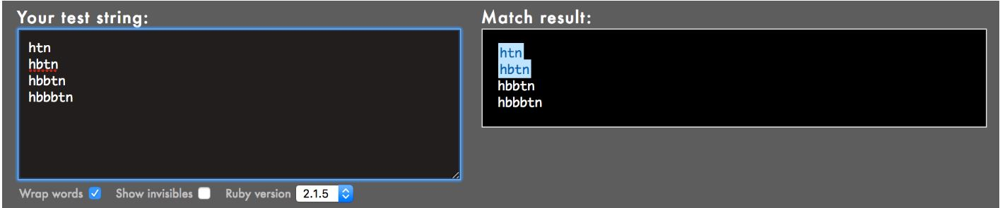
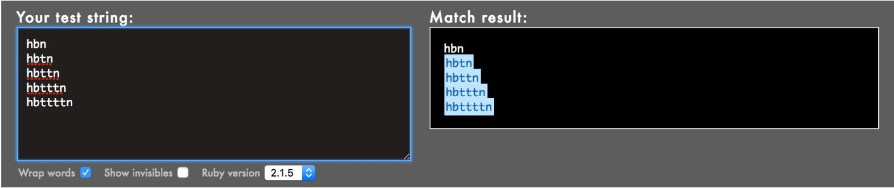
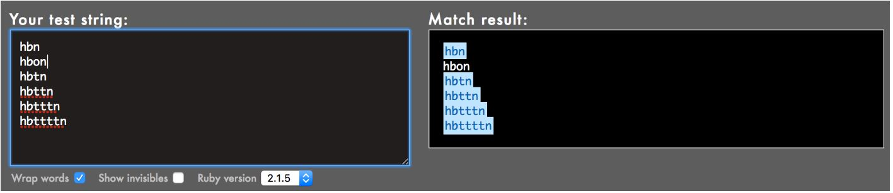

0x06. Regular Expression
========================

## Concepts
For this project, we expect you to look at this concept:

                         **Regular Expression*
A regular expression, commonly called a “regexp”, is a sequence of characters that define a search pattern.  It is mainly for use in pattern matching with strings, or string matching (i.e. it operates like a “find and replace” command). While it is a very powerful tool, it is also very dangerous because of its complexity.


Some people, when confronted with a problem, think `“I know, I’ll use regular expressions.”` And, `Now they have two problems`. (super classic joke in the industry) One thing you have to be careful with is that different languages use different `regexp` engines. That means that a regexp in Python, for example, will be interpreted differently in Javascript: Regular expressions are everywhere and software engineers, no matter their positions, will have to use them during their careers. System administrators and DevOps are the ones using them the most because they are very handy for log parsing.

**Read about regexp:**
  * [Regular Expression Info](http://www.regular-expressions.info/)
  * [Javas Script Regexp-W3School](http://www.w3schools.com/jsref/jsref_obj_regexp.asp) Play with regexp (or compose them):
  * [Ruby Engine](http://rubular.com/)
  * [PHP/Javascript/Python Regex Engine]( https://regex101.com/)

## Background Context
For this project, you have to build your regular expression using Oniguruma, a regular expression library which is used by Ruby by default. Note that other regular expression libraries sometimes have different properties. Because the focus of this exercise is to play with regular expressions (regex), here is the Ruby code that you should use, just replace the regexp part, meaning the code in between the //:
```
sylvain@ubuntu$ cat example.rb
#!/usr/bin/env ruby
puts ARGV[0].scan(/127.0.0.[0-9]/).join
sylvain@ubuntu$
sylvain@ubuntu$ ./example.rb 127.0.0.2
127.0.0.2
sylvain@ubuntu$ ./example.rb 127.0.0.1
127.0.0.1
sylvain@ubuntu$ ./example.rb 127.0.0.a
```
## Resources
**Read or watch:**
  * [Regular expressions - basics](https://www.slideshare.net/neha_jain/introducing-regular-expressions)
  * [Regular expressions - advanced](https://www.slideshare.net/neha_jain/advanced-regular-expressions-80296518)
  * [Rubular is your best friend](https://rubular.com/)
  * [Use a regular expression against a problem: now you have 2 problems](https://blog.codinghorror.com/regular-expressions-now-you-have-two-problems/)
  * [Learn Regular Expressions with simple, interactive exercises](https://regexone.com/)

## Requirements
### General
  * Allowed editors: `vi`, `vim`, `emacs`
  * All your files will be interpreted on `Ubuntu 20.04 LTS`
  * All your files should end with a new line
  * A `README.md` file, at the root of the folder of the project, is mandatory
  * All your Bash script files must be executable
  * The first line of all your Bash scripts should be exactly `#!/usr/bin/env ruby`
  * All your `regex` must be built for the `Oniguruma library`

## Quiz questions


## Tasks
## 0. Simply matching School



**Requirements:**
  * The regular expression must match `School`
  * Using the project instructions, create a Ruby script that accepts one argument and pass it to a regular expression matching method

Example:
```
sylvain@ubuntu$ ./0-simply_match_school.rb School | cat -e
School$
sylvain@ubuntu$ ./0-simply_match_school.rb "Best School" | cat -e
School$
sylvain@ubuntu$ ./0-simply_match_school.rb "School Best School" | cat -e
SchoolSchool$
sylvain@ubuntu$ ./0-simply_match_school.rb "Grace Hopper" | cat -e
$
```
**Repo:**
  * GitHub repository: alx-system_engineering-devops
  * Directory: 0x06-regular_expressions
  * File: 0-simply_match_school.rb

## 1. Repetition Token #0



**Requirements:**
  * Find the regular expression that will match the above cases
  * Using the project instructions, create a Ruby script that accepts one argument and pass it to a regular expression matching method

**Repo:**
  * GitHub repository: `alx-system_engineering-devops`
  * Directory: `0x06-regular_expressions`
  * File: `1-repetition_token_0.rb`

## 2. Repetition Token #1



**Requirements:**
  * Find the regular expression that will match the above cases
  * Using the project instructions, create a Ruby script that accepts one argument and pass it to a regular expression matching method

**Repo:**
  * GitHub repository: `alx-system_engineering-devops`
  * Directory: `0x06-regular_expressions`
  * File: `2-repetition_token_1.rb`

## 3. Repetition Token #2



**Requirements:**
  * Find the regular expression that will match the above cases
  * Using the project instructions, create a Ruby script that accepts one argument and pass it to a regular expression matching method

**Repo:**
  * GitHub repository: `alx-system_engineering-devops`
  * Directory: `0x06-regular_expressions`
  * File: `3-repetition_token_2.rb`

## 4. Repetition Token #3



**Requirements:**
  * Find the regular expression that will match the above cases
  * Using the project instructions, create a Ruby script that accepts one argument and pass it to a regular expression matching method
  * Your regex should not contain square brackets
  
**Repo:**
  * GitHub repository: `alx-system_engineering-devops`
  * Directory: `0x06-regular_expressions`
  * File: `4-repetition_token_3.rb`